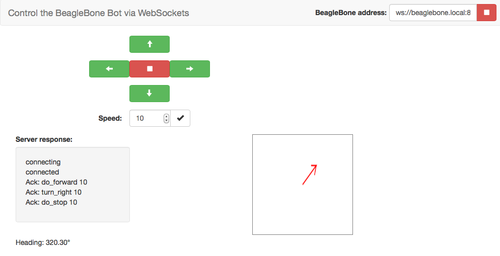

beaglebone-robot
================

A simple browser client that is able to send commands over web sockets to a BeagleBone Black running the server code.



## Client
Bootstrap/JQuery based web page that will connect to the server and send simple commands over web sockets to control the robot.

## Server
Control code written in Python.

Requires:

1. Adafruit_BBIO Python library (installed by default on newer BeagleBone Black images)
2. Python json library (also installed by default)

## Robot
Simple two-wheel (differential drive) robot.  Motors are connected to a [Sabertooth 2x12](https://www.dimensionengineering.com/products/sabertooth2x12) motor controller allowing simple control and easy separation of voltages.

Control messages are sent to the controller using "packetised serial mode".

## Client-Server Communication
Control messages are passed from client to server as JSON over a web sockets transport.  Messages used are:

### Client -=> Server JSON messages
+ `speed` is in percent and should be sent with every command.
+ Stop command will ignore speed, and stop robot.
+ Speed command when stopped will not start movement.
```JavaScript
    { event: 'drive',
        cmd: {
                direction: 'fwd|rev|left|right|stop|speed',
                speed: '0-100'
            }
    }
````

### Server -=> Client JSON messages
Sent in response to each command sent from the client
```Javascript
    { event: 'ack',
        cmd: {
                cmd: 'command and speed executed by server'
            }
    }
````

Sent when an obstacle is detected on one of the configured sensors.  Robot will take "evasive" action when an obstacle is detected.  Robot will reverse at 150% of set speed for a short period that is proportional to speed and then stop.
```Javascript
    { event: 'obstacle',
       data: {
                sensor: 'sensor designation that obstacle was detected on',
                name: 'descriptive name of sensor (eg: left, right)'
            }
    }
````

Client can act on obstacle message to take further action.